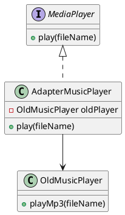
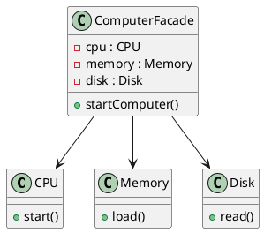

## Structural Patterns

# 1. Adapter Pattern

- **Idea:** Converts one interface into another that a client expects.
- **Simple English:** Like a power plug adapter — lets incompatible interfaces work together.

**Use Case:**

* Making an old system work with a new one (legacy code integration).
* Example: Using a memory card in a laptop via a card reader.

**Pros:** Reuse existing classes, no need to modify old code
**Cons:** Adds extra layer of complexity
**SOLID:** Supports OCP (can add new adapters without modifying clients)

**Java Example:**

```java
// Target interface
interface MediaPlayer {
    void play(String fileName);
}

// Adaptee
class OldMusicPlayer {
    void playMp3(String fileName) {
        System.out.println("Playing mp3: " + fileName);
    }
}

// Adapter
class AdapterMusicPlayer implements MediaPlayer {
    private OldMusicPlayer oldPlayer = new OldMusicPlayer();

    public void play(String fileName) {
        oldPlayer.playMp3(fileName);
    }
}

// Client
public class AdapterDemo {
    public static void main(String[] args) {
        MediaPlayer player = new AdapterMusicPlayer();
        player.play("song.mp3");
    }
}
```

**PlantUML:**



---

Sure! Let’s go step by step for the **Facade Pattern**.

---

## Facade Pattern

**Definition:** Provide a simple interface to a complex system. The client interacts with the facade instead of multiple subsystems.

**Simple English:** Like a TV remote — one button hides many operations inside the TV.

---

### Differences vs Other Structural Patterns

| Feature | Facade                        | Adapter                            | Decorator                | Composite                          |
| ------- | ----------------------------- | ---------------------------------- | ------------------------ | ---------------------------------- |
| Purpose | Simplify complex system       | Convert one interface to another   | Add features dynamically | Treat group & individual uniformly |
| Scope   | Provides a simple entry point | Makes incompatible interfaces work | Enhances objects         | Manages tree-like structures       |

---

### Use Case Scenario

* Simplifying database access (JDBC helper).
* Starting a computer (CPU, Memory, Disk) with one method.
* Complex subsystem like home theater controls.

---

### Pros

* Hides complexity.
* Easier to use for clients.

### Cons

* Can become a “god object” if too many responsibilities are added.
* Does not add new functionality, just simplifies access.

---

### SOLID Principles

* **SRP (Single Responsibility Principle):** Facade has one responsibility: simplifying subsystem usage.
* Can help indirectly with **OCP** by isolating subsystem changes from the client.

---

### Java Example

```java
// Subsystems
class CPU {
    void start() { System.out.println("CPU started"); }
}
class Memory {
    void load() { System.out.println("Memory loaded"); }
}
class Disk {
    void read() { System.out.println("Disk read"); }
}

// Facade
class ComputerFacade {
    private CPU cpu = new CPU();
    private Memory memory = new Memory();
    private Disk disk = new Disk();

    public void startComputer() {
        cpu.start();
        memory.load();
        disk.read();
        System.out.println("Computer started");
    }
}

// Client
public class FacadeDemo {
    public static void main(String[] args) {
        ComputerFacade computer = new ComputerFacade();
        computer.startComputer();
    }
}
```

---

### PlantUML Class Diagram



---

**In Simple Words:**

* The client only talks to **ComputerFacade**.
* CPU, Memory, and Disk are hidden behind the facade.
* Makes the complex system easier to use without exposing all details.

---

## Summary

| Pattern | Simple English Meaning           | Use Case                                                | Pros                          | Cons                                                      | SOLID Support       |
| ------- | -------------------------------- | ------------------------------------------------------- | ----------------------------- | --------------------------------------------------------- | ------------------- |
| Adapter | Convert one interface to another | Legacy system integration                               | Reuse old code                | Extra layer of complexity                                 | OCP                 |
| Facade  | Simplify complex systems         | Start a computer, database helper, home theater control | Hides complexity, easy to use | Can become a “god object”, does not add new functionality | SRP, OCP indirectly |
