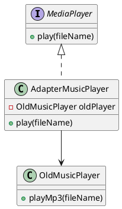
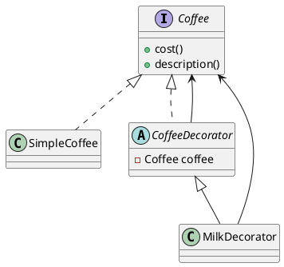
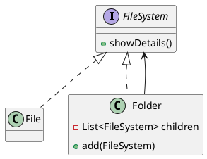
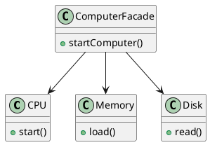

## Structural Patterns

# 1. Adapter Pattern

**Idea:** Converts one interface into another that a client expects.
**Simple English:** Like a power plug adapter — lets incompatible interfaces work together.

**Use Case:**

* Making an old system work with a new one (legacy code integration).
* Example: Using a memory card in a laptop via a card reader.

**Pros:** Reuse existing classes, no need to modify old code
**Cons:** Adds extra layer of complexity
**SOLID:** Supports OCP (can add new adapters without modifying clients)

**Java Example:**

```java
// Target interface
interface MediaPlayer {
    void play(String fileName);
}

// Adaptee
class OldMusicPlayer {
    void playMp3(String fileName) {
        System.out.println("Playing mp3: " + fileName);
    }
}

// Adapter
class AdapterMusicPlayer implements MediaPlayer {
    private OldMusicPlayer oldPlayer = new OldMusicPlayer();

    public void play(String fileName) {
        oldPlayer.playMp3(fileName);
    }
}

// Client
public class AdapterDemo {
    public static void main(String[] args) {
        MediaPlayer player = new AdapterMusicPlayer();
        player.play("song.mp3");
    }
}
```

**PlantUML:**



---

# 2. Decorator Pattern

**Idea:** Attach additional features to an object dynamically.
**Simple English:** Adding toppings to a pizza without altering the base pizza.

**Use Case:**

* Extending GUI components (adding scrollbars, borders).
* Adding responsibilities like logging, compression, and encryption to streams.

**Pros:** More flexible than inheritance
**Cons:** Can lead to too many small classes
**SOLID:** Strongly supports OCP (new features without modifying old code)

**Java Example:**

```java
interface Coffee {
    int cost();
    String description();
}

class SimpleCoffee implements Coffee {
    public int cost() { return 5; }
    public String description() { return "Simple Coffee"; }
}

abstract class CoffeeDecorator implements Coffee {
    protected Coffee coffee;
    public CoffeeDecorator(Coffee coffee) { this.coffee = coffee; }
    public int cost() { return coffee.cost(); }
    public String description() { return coffee.description(); }
}

class MilkDecorator extends CoffeeDecorator {
    public MilkDecorator(Coffee coffee) { super(coffee); }
    public int cost() { return coffee.cost() + 2; }
    public String description() { return coffee.description() + ", Milk"; }
}

public class DecoratorDemo {
    public static void main(String[] args) {
        Coffee coffee = new MilkDecorator(new SimpleCoffee());
        System.out.println(coffee.description() + " = $" + coffee.cost());
    }
}
```

**PlantUML:**



---

# 3. Composite Pattern

**Idea:** Treat individual objects and groups of objects uniformly.
**Simple English:** Like files and folders — a folder can contain files or other folders.

**Use Case:**

* File system representation
* GUI components (buttons inside panels inside windows)

**Pros:** Simplifies client code, treats single and group objects the same
**Cons:** Can make design overly general
**SOLID:** Supports SRP and OCP

**Java Example:**

```java
import java.util.*;

interface FileSystem {
    void showDetails();
}

class File implements FileSystem {
    private String name;
    public File(String name) { this.name = name; }
    public void showDetails() { System.out.println("File: " + name); }
}

class Folder implements FileSystem {
    private String name;
    private List<FileSystem> children = new ArrayList<>();
    public Folder(String name) { this.name = name; }
    public void add(FileSystem fs) { children.add(fs); }
    public void showDetails() {
        System.out.println("Folder: " + name);
        for (FileSystem fs : children) fs.showDetails();
    }
}

public class CompositeDemo {
    public static void main(String[] args) {
        File file1 = new File("a.txt");
        File file2 = new File("b.txt");
        Folder folder = new Folder("MyDocs");
        folder.add(file1);
        folder.add(file2);
        folder.showDetails();
    }
}
```

**PlantUML:**



---

# 4. Facade Pattern

**Idea:** Provide a simple interface to a complex system.
**Simple English:** Like a TV remote — one button hides many complex operations inside the TV.

**Use Case:**

* Simplifying complex APIs (e.g., JDBC connection helpers).
* Providing a single entry point for subsystems.

**Pros:** Hides complexity, makes systems easier to use
**Cons:** Can become a “god object” if it grows too big
**SOLID:** Supports SRP (facade has one responsibility: simplify use)

**Java Example:**

```java
class CPU {
    void start() { System.out.println("CPU started"); }
}
class Memory {
    void load() { System.out.println("Memory loaded"); }
}
class Disk {
    void read() { System.out.println("Disk read"); }
}

// Facade
class ComputerFacade {
    private CPU cpu = new CPU();
    private Memory memory = new Memory();
    private Disk disk = new Disk();

    public void startComputer() {
        cpu.start();
        memory.load();
        disk.read();
        System.out.println("Computer started");
    }
}

public class FacadeDemo {
    public static void main(String[] args) {
        ComputerFacade computer = new ComputerFacade();
        computer.startComputer();
    }
}
```

**PlantUML:**



---

# Quick Summary

| Pattern   | Simple English Meaning            | Use Case                  | Pros                 | Cons                      | SOLID Support |
| --------- | --------------------------------- | ------------------------- | -------------------- | ------------------------- | ------------- |
| Adapter   | Convert one interface to another  | Legacy system integration | Reuse old code       | Extra layer of complexity | OCP           |
| Decorator | Add features dynamically          | Coffee with toppings, GUI | Extensible, flexible | Many small classes        | OCP           |
| Composite | Treat groups and objects the same | File system, GUI trees    | Uniform treatment    | Over-generalization       | SRP, OCP      |
| Facade    | Simplified interface              | TV remote, JDBC helper    | Hides complexity     | Risk of god object        | SRP           |

---

Would you like me to also prepare **a combined PlantUML diagram** showing all four structural patterns together in one view for quick study?
