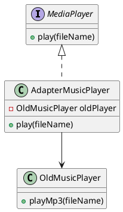
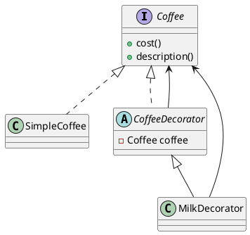

## Structural Patterns

# 1. Adapter Pattern

- **Idea:** Converts one interface into another that a client expects.
- **Simple English:** Like a power plug adapter — lets incompatible interfaces work together.

**Use Case:**

* Making an old system work with a new one (legacy code integration).
* Example: Using a memory card in a laptop via a card reader.

**Pros:** Reuse existing classes, no need to modify old code
**Cons:** Adds extra layer of complexity
**SOLID:** Supports OCP (can add new adapters without modifying clients)

**Java Example:**

```java
// Target interface
interface MediaPlayer {
    void play(String fileName);
}

// Adaptee
class OldMusicPlayer {
    void playMp3(String fileName) {
        System.out.println("Playing mp3: " + fileName);
    }
}

// Adapter
class AdapterMusicPlayer implements MediaPlayer {
    private OldMusicPlayer oldPlayer = new OldMusicPlayer();

    public void play(String fileName) {
        oldPlayer.playMp3(fileName);
    }
}

// Client
public class AdapterDemo {
    public static void main(String[] args) {
        MediaPlayer player = new AdapterMusicPlayer();
        player.play("song.mp3");
    }
}
```

**PlantUML:**



---

# 2. Decorator Pattern

- **Idea:** Attach additional features to an object dynamically.
- **Simple English:** Adding toppings to a pizza without altering the base pizza.

**Use Case:**

* Extending GUI components (adding scrollbars, borders).
* Adding responsibilities like logging, compression, and encryption to streams.

**Pros:** More flexible than inheritance
**Cons:** Can lead to too many small classes
**SOLID:** Strongly supports OCP (new features without modifying old code)

**Java Example:**

```java
interface Coffee {
    int cost();
    String description();
}

class SimpleCoffee implements Coffee {
    public int cost() { return 5; }
    public String description() { return "Simple Coffee"; }
}

abstract class CoffeeDecorator implements Coffee {
    protected Coffee coffee;
    public CoffeeDecorator(Coffee coffee) { this.coffee = coffee; }
    public int cost() { return coffee.cost(); }
    public String description() { return coffee.description(); }
}

class MilkDecorator extends CoffeeDecorator {
    public MilkDecorator(Coffee coffee) { super(coffee); }
    public int cost() { return coffee.cost() + 2; }
    public String description() { return coffee.description() + ", Milk"; }
}

public class DecoratorDemo {
    public static void main(String[] args) {
        Coffee coffee = new MilkDecorator(new SimpleCoffee());
        System.out.println(coffee.description() + " = $" + coffee.cost());
    }
}
```

**PlantUML:**



## Summary

| Pattern   | Simple English Meaning            | Use Case                  | Pros                 | Cons                      | SOLID Support |
| --------- | --------------------------------- | ------------------------- | -------------------- | ------------------------- | ------------- |
| Adapter   | Convert one interface to another  | Legacy system integration | Reuse old code       | Extra layer of complexity | OCP           |
| Decorator | Add features dynamically          | Coffee with toppings, GUI | Extensible, flexible | Many small classes        | OCP           |
